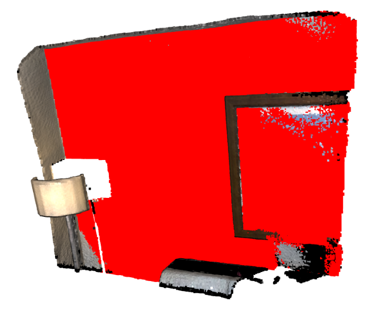

# RANSAC-plane-fitting

RANSAC or Random Sample Consensus is an iterative algorithm for estimating a model or approximation of the given data, which is subject to outliers.
Here, the task is to calculate the best plane fit in the given pointcloud data. This is achieved using Open3d and RANSAC algorithm. The code can be found in the repository.

The given point cloud can be visualized in the image given below:

The output after running RANSAC algorithm to get the best plane fit can be visualized below:

